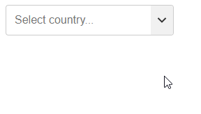

# Select Autocomplete

_Version 0.1_

A select or input with autocomplete of predefined values.



[See Demo](https://csspoo.com/select-autocomplete/example.html)

## In short

- Simple to use
- Small filesize (1.5kB minified + gzipped)
- Keyboard support
- No dependencies
- HTML web component
- Vanilla JS

## Setup

### CSS

Place it within `<head></head>`.

<!-- prettier-ignore -->
```html
<link rel="stylesheet" href="assets/css/dist/select-autocomplete.min.css">
```

### Javaascript

In most cases place it just before `</body>`.

```html
<script src="assets/js/dist/select-autocomplete.min.js"></script>
```

## Usage

<!-- prettier-ignore -->
```html
<select-autocomplete>
  <label><input placeholder="Select a country..."></label>

  <datalist>
    <option value="Finland">
    <option value="Norway">
    <option value="Sweden">
  </datalist>
</select-autocomplete>
```

You can add more HTML to this component, if you need to. However, make sure to not remove the current elements. All of the elements above are are required, except for the `label`.

## Options

There are no options except for what you see in the usage example above.

## Events

### Submit

The `submit` event is fired when the user first select an option and then press enter to confirm.

The example below will add the `submit` event to the first `select-autocomplete` element.

```html
<script>
  document
    .querySelector("select-autocomplete")
    .addEventListener("submit", (e) => {
      console.log(e.detail.value);
    });
</script>
```

## Compared to input with datalist

There is already a native way to provide autocomplete with combining an input field with a datalist. However there are some benefits of using this script instead.

1. It's much easier to style, because it does not use the shadow dom.
1. It's easier to manipulate the HTML, because it does not use the shadow dom.
1. It behaves a bit different, better in our opinion.

https://developer.mozilla.org/en-US/docs/Web/HTML/Element/datalist

## Donate

Donate to [https://www.paypal.me/DevoneraAB](DevoneraAB) if you want.

## License

MIT
